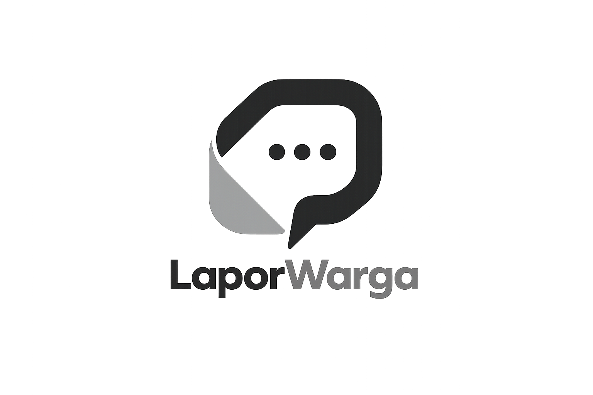

<div align="center">
  

  <h1>🏙️ LaporWarga</h1>
  <p><strong>Platform Pelaporan Warga Cerdas · Smart City Enterprise System</strong></p>

  <p>
    
    
    
    
    
  </p>

  <p>
    
  </p>

  <p>
    <a href="https://lapor-warga-mocha.vercel.app/" target="_blank">
      
    </a>
  </p>

  <p>
    
    
    
  </p>

  <p>
    <strong>🌐 <a href="https://lapor-warga-mocha.vercel.app/">https://lapor-warga-mocha.vercel.app/</a></strong>
  </p>
</div>

---

## 📋 Deskripsi Proyek

**LaporWarga** adalah platform pelaporan masyarakat berbasis **Smart City** yang dibangun menggunakan ekosistem **Google** secara penuh. Platform ini memungkinkan warga kota melaporkan masalah infrastruktur (jalan rusak, sampah menumpuk, lampu mati, banjir, dll.) secara *real-time* langsung dari perangkat apa pun.

Laporan diproses secara otomatis dengan **Gemini AI** untuk klasifikasi kategori & prioritas, disimpan di **Firebase Firestore** + **Realtime Database**, dikelola oleh petugas melalui dashboard enterprise, dan divisualisasikan secara geografis melalui peta interaktif.

> 🏆 **Diikutsertakan dalam Google JuaraVibeCoding 2026** — membangun solusi nyata dengan teknologi Google untuk masalah nyata masyarakat Indonesia.

---

## ✨ Fitur Utama

### 👥 Untuk Warga (Citizen)
| Fitur | Deskripsi |
|---|---|
| 📸 **Multi-Photo Upload** | Upload hingga 5 foto bukti laporan via Cloudinary CDN |
| 📍 **Geotagging Interaktif** | Lokasi dipilih via peta interaktif (Leaflet + OpenStreetMap) |
| 🤖 **Klasifikasi AI** | Gemini AI otomatis mengkategorikan & menentukan urgensi laporan |
| 💬 **Chat Real-time** | Diskusi langsung dengan petugas, reply & avatar profil |
| 🔔 **Notifikasi In-App** | Update status & pesan baru secara real-time |
| 📊 **Tracking Status** | Pantau progres: Menunggu → Diverifikasi → Diproses → Selesai |

### 👮 Untuk Petugas (Officer)
| Fitur | Deskripsi |
|---|---|
| 📋 **Dashboard Tugas** | Laporan yang ditugaskan ke petugas |
| ✅ **Update Status** | Ubah status & tambah catatan penanganan |
| 🗺️ **Peta Real-time** | Sebaran laporan aktif di seluruh kota |
| 💬 **Chat dengan Pelapor** | Diskusi untuk klarifikasi laporan |

### 🛡️ Untuk Admin
| Fitur | Deskripsi |
|---|---|
| 📈 **Dashboard Analitik** | Statistik resolusi, kategori, trend laporan (Recharts) |
| 👥 **Manajemen Pengguna** | Kelola akun warga, petugas, dan admin |
| 🔀 **Assign Laporan** | Tugaskan laporan ke petugas yang sesuai |
| ⚙️ **Pengaturan Sistem** | Konfigurasi kategori, prioritas, dan SLA |

---

## 🏗️ Arsitektur Sistem

```
┌──────────────────────────────────────────────────────────┐
│                  GOOGLE CLOUD RUN                         │
│            (Next.js 15 Container · Docker)               │
├──────────────────────────────────────────────────────────┤
│  Landing Page (SSG) │ Dashboard (Client) │ API Routes    │
│                     │                    │ /api/ai/*     │
├──────────────── FIREBASE BACKEND ────────────────────────┤
│                                                          │
│  Cloud Firestore          Firebase Realtime Database     │
│  ├── /reports             ├── /chats/{reportId}          │
│  ├── /users               └── /presence                  │
│  ├── /notifications                                      │
│  └── /settings                                          │
│                                                          │
│  Firebase Auth (Email/Password)                          │
│  Security Rules (Firestore + RTDB · Role-Based)         │
│                                                          │
├──────────────── THIRD-PARTY ─────────────────────────────┤
│  Cloudinary (Image CDN)    │  Gemini AI (Classification) │
│  Leaflet + OpenStreetMap   │  Framer Motion (Animation)  │
└──────────────────────────────────────────────────────────┘
```

### CI/CD Pipeline
```
Push to main
    │
    ▼
🔍 Quality Check (TypeScript + ESLint)
    │
    ▼
🐳 Build Docker Image
    │
    ▼
📦 Push to Google Container Registry (GCR)
    │
    ▼
☁️ Deploy to Cloud Run (asia-southeast2)
```

---

## 🔧 Stack Teknologi

### Core Framework
| Teknologi | Versi | Fungsi |
|---|---|---|
| **Next.js** | 15+ | Full-stack React framework (App Router) |
| **React** | 19 | UI library |
| **TypeScript** | 5 | Type safety |
| **Tailwind CSS** | 4 | Styling utility-first |

### 🔥 Google Ecosystem (Full Stack)
| Teknologi | Fungsi |
|---|---|
| **Firebase Authentication** | Login email/password + role management |
| **Cloud Firestore** | Database laporan, users, notifikasi |
| **Firebase Realtime Database** | Chat real-time diskusi laporan |
| **Firebase Security Rules** | Otorisasi akses data per role (citizen/officer/admin) |
| **Gemini AI** (`gemini-1.5-flash`) | Klasifikasi otomatis kategori & prioritas |
| **Google Cloud Run** | Deployment container serverless |
| **Google Container Registry** | Penyimpanan Docker image |

### Third-Party
| Teknologi | Fungsi |
|---|---|
| **Cloudinary** | CDN upload & optimasi foto (WebP auto-convert) |
| **Leaflet / OpenStreetMap** | Peta interaktif geotagging |
| **Framer Motion** | Animasi UI premium |
| **Zustand** | State management (auth store) |
| **Recharts** | Grafik analitik admin dashboard |
| **React Hook Form + Zod** | Form validation & schema |
| **Sonner** | Toast notifications |
| **Shadcn/ui** | UI component library |

---

## 🛡️ Keamanan

### Firebase Security Rules (Role-Based Access Control)
```javascript
// Warga: hanya bisa baca/update laporan sendiri (status Menunggu)
// Petugas: bisa update status laporan yang ditugaskan
// Admin: akses penuh ke semua koleksi

/users/{userId}     → isOwner || isAdmin
/reports/{reportId} → read: isAuthenticated | write: isOwner || isStaff
/reports/{id}/chats → isOwner(report) || isStaff
/notifications      → isOwner(notif.userId)
```

### API Security
- ✅ **Gemini API Key** hanya dipakai di server-side (`/api/ai/classify`)
- ✅ **Cloudinary** pakai upload preset unsigned — secret tidak terekspos di frontend
- ✅ **Semua env vars** disimpan sebagai **GitHub Secrets** & **Cloud Run env vars**
- ✅ File `.env*` dikecualikan dari git (`.gitignore`)
- ✅ **Input validation** di semua form menggunakan Zod schema
- ✅ **File upload**: max 5 foto, JPG/PNG/WebP, max 10MB per foto
- ✅ **Non-root Docker user** untuk isolasi container
- ✅ **TruffleHog + CodeQL** scanning otomatis via GitHub Actions

### Headers & Container
- Docker image menggunakan `node:20-alpine` (minimal attack surface)
- Multi-stage build (deps → builder → runner) untuk image size optimal
- Health check endpoint bawaan (`HEALTHCHECK`)

---

## 🚀 Deployment ke Google Cloud Run

### Prasyarat
```bash
# Install Google Cloud CLI
brew install google-cloud-sdk   # macOS
# atau download di: https://cloud.google.com/sdk/docs/install

gcloud auth login
gcloud config set project YOUR_GCP_PROJECT_ID

# Enable APIs yang dibutuhkan
gcloud services enable run.googleapis.com
gcloud services enable containerregistry.googleapis.com
gcloud services enable cloudbuild.googleapis.com
```

### Opsi A: Deploy Otomatis via GitHub Actions (Direkomendasikan)

1. **Setup GitHub Secrets** (Settings → Secrets → Actions):

| Secret | Nilai |
|---|---|
| `GCP_PROJECT_ID` | ID project GCP Anda |
| `GCP_SA_KEY` | JSON service account key (dengan role Cloud Run Admin + Storage Admin) |
| `NEXT_PUBLIC_FIREBASE_API_KEY` | Firebase Web API Key |
| `NEXT_PUBLIC_FIREBASE_AUTH_DOMAIN` | project.firebaseapp.com |
| `NEXT_PUBLIC_FIREBASE_PROJECT_ID` | Firebase project ID |
| `NEXT_PUBLIC_FIREBASE_STORAGE_BUCKET` | project.appspot.com |
| `NEXT_PUBLIC_FIREBASE_MESSAGING_SENDER_ID` | Sender ID |
| `NEXT_PUBLIC_FIREBASE_APP_ID` | App ID |
| `NEXT_PUBLIC_FIREBASE_DATABASE_URL` | RTDB URL |
| `GEMINI_API_KEY` | Dari Google AI Studio |
| `NEXT_PUBLIC_CLOUDINARY_CLOUD_NAME` | Cloud name |
| `NEXT_PUBLIC_CLOUDINARY_UPLOAD_PRESET` | Upload preset |

2. **Push ke branch `main`** → pipeline otomatis berjalan!

### Opsi B: Deploy Manual

```bash
# 1. Clone repo
git clone https://github.com/ganddtn40/Lapor-Warga.git
cd Lapor-Warga

# 2. Setup env
cp .env.example .env.local
# Edit .env.local dengan nilai asli

# 3. Build Docker image
docker build \
  --build-arg NEXT_PUBLIC_FIREBASE_API_KEY="..." \
  --build-arg NEXT_PUBLIC_FIREBASE_PROJECT_ID="..." \
  -t gcr.io/YOUR_PROJECT_ID/laporwarga .

# 4. Push ke GCR
docker push gcr.io/YOUR_PROJECT_ID/laporwarga

# 5. Deploy ke Cloud Run
gcloud run deploy laporwarga \
  --image gcr.io/YOUR_PROJECT_ID/laporwarga \
  --platform managed \
  --region asia-southeast2 \
  --allow-unauthenticated \
  --port 3000 \
  --memory 512Mi \
  --cpu 1 \
  --min-instances 0 \
  --max-instances 10
```

### Opsi C: Deploy Firebase Rules
```bash
# Install Firebase CLI
npm install -g firebase-tools
firebase login

# Deploy rules & indexes
firebase deploy --only firestore,database --project YOUR_PROJECT_ID
```

---

## ⚙️ Konfigurasi Environment Variables

Salin `.env.example` ke `.env.local`:

```env
# ── Firebase ──────────────────────────────────────────────────────────────
NEXT_PUBLIC_FIREBASE_API_KEY=           # Firebase Web API Key
NEXT_PUBLIC_FIREBASE_AUTH_DOMAIN=       # project.firebaseapp.com
NEXT_PUBLIC_FIREBASE_PROJECT_ID=        # project-id
NEXT_PUBLIC_FIREBASE_STORAGE_BUCKET=    # project.appspot.com
NEXT_PUBLIC_FIREBASE_MESSAGING_SENDER_ID=
NEXT_PUBLIC_FIREBASE_APP_ID=
NEXT_PUBLIC_FIREBASE_DATABASE_URL=      # https://project-rtdb.region.firebasedatabase.app

# ── Gemini AI ─────────────────────────────────────────────────────────────
GEMINI_API_KEY=                         # Dari https://aistudio.google.com

# ── Cloudinary ────────────────────────────────────────────────────────────
NEXT_PUBLIC_CLOUDINARY_CLOUD_NAME=      # Cloud name
NEXT_PUBLIC_CLOUDINARY_UPLOAD_PRESET=   # Unsigned upload preset name
```

> ⚠️ **JANGAN** commit `.env.local`. File ini sudah ada di `.gitignore`.

---

## 🗂️ Struktur Proyek

```
laporwarga/
├── .github/
│   └── workflows/
│       ├── deploy.yml          # CI/CD → Google Cloud Run
│       └── security.yml        # Security scanning (CodeQL, TruffleHog)
├── app/
│   ├── (auth)/                 # Login, Register, Forgot Password, Verify Email
│   ├── (dashboard)/            # Protected dashboard routes (role-based)
│   │   ├── layout.tsx          # Sidebar + header navigation
│   │   └── dashboard/
│   │       ├── page.tsx        # Beranda (role-specific view)
│   │       ├── lapor/          # Form buat laporan baru (AI + foto)
│   │       ├── detail/[id]/    # Detail laporan + chat real-time
│   │       ├── laporan/        # Manajemen laporan (admin)
│   │       ├── pengguna/       # Manajemen user (admin)
│   │       ├── tugas/          # Daftar tugas (officer)
│   │       ├── peta/           # Peta interaktif sebaran laporan
│   │       ├── profil/         # Profil & edit akun
│   │       └── settings/       # Pengaturan sistem (admin)
│   ├── api/
│   │   └── ai/classify/        # Gemini AI server-side endpoint
│   └── peta/                   # Peta publik (tanpa login)
├── components/
│   ├── shared/                 # Header, Sidebar, MapInner
│   └── ui/                     # Shadcn + custom components
│       ├── image-gallery.tsx   # Multi-photo gallery viewer
│       ├── location-picker-map.tsx  # Peta picker interaktif
│       └── notification-dropdown.tsx # Real-time notifications
├── features/                   # Feature-specific logic
├── lib/
│   ├── firebase.ts             # Firebase SDK initialization
│   └── cloudinary.ts           # Cloudinary helpers
├── store/
│   └── auth-store.ts           # Zustand auth state management
├── firestore.rules             # Firestore security rules (RBAC)
├── database.rules.json         # RTDB security rules
├── firebase.json               # Firebase deploy config
├── firestore.indexes.json      # Composite indexes
├── Dockerfile                  # Multi-stage container build
├── .dockerignore               # Docker build exclusions
└── .env.example                # Environment variables template
```

---

## 🧑‍💻 Cara Menjalankan Lokal

```bash
# 1. Clone repo
git clone https://github.com/ganddtn40/Lapor-Warga.git
cd Lapor-Warga

# 2. Install dependencies
npm install

# 3. Setup environment
cp .env.example .env.local
# Edit .env.local dengan nilai Firebase & API key Anda

# 4. Jalankan development server
npm run dev
# → http://localhost:3000

# 5. (Opsional) Deploy Firebase Rules
npx firebase deploy --only firestore,database
```

### Role Testing
| Role | Cara Setup |
|---|---|
| **Admin** | Set field `role: "admin"` di Firestore collection `users/{uid}` |
| **Officer** | Set field `role: "officer"` di Firestore collection `users/{uid}` |
| **Citizen** | Default saat register (field `role: "citizen"`) |

---

## 📊 Alur Data

```
Warga mengisi form laporan
    │
    ▼
📸 Foto diupload ke Cloudinary CDN
    │
    ▼
🤖 Gemini AI mengklasifikasi kategori & prioritas
    │
    ▼
📝 Laporan disimpan ke Cloud Firestore
    │
    ├── 🔔 Notifikasi dikirim ke Admin
    │
    └── 📍 Marker muncul di Peta Real-time
             │
             ▼
         👮 Admin assign ke Petugas
             │
             ├── 🔔 Notifikasi dikirim ke Petugas
             │
             └── 💬 Chat dibuka antara Warga ↔ Petugas
                      │
                      ▼
                 ✅ Status diupdate → Selesai
                 🔔 Notifikasi ke Warga
```

---

## 📸 Tampilan Aplikasi

| Landing Page | Dashboard Warga | Detail & Chat |
|:---:|:---:|:---:|
| *Real-time stats · Live counter* | *Laporan dengan status* | *Chat + reply + avatar* |

| Peta Interaktif | Admin Analytics | Form Laporan (AI) |
|:---:|:---:|:---:|
| *Sebaran laporan kota* | *Dashboard statistik Recharts* | *AI auto-classification* |

---

## 🤝 Kontribusi

Proyek ini dibangun untuk **Google JuaraVibeCoding 2026**. Kontribusi terbuka setelah lomba selesai.

---

## 📄 Lisensi

MIT License — bebas digunakan dan dikembangkan.

---

<div align="center">
  <p>Built with ❤️ for Indonesia · Powered by Google Technology Stack</p>
  <p>
    <strong>Google JuaraVibeCoding 2026</strong>
  </p>
  <p>
    <a href="https://lapor-warga-mocha.vercel.app/">🌐 Live Demo</a>
  </p>
  <p>
    
    
    
    
    
  </p>
</div>
